# Blueberry (bb)


Another AI Agent, essentially the "Hello World" of agentic computeing.    This repos is a .NET 9 console application that connects LLMs to local tools via the Model Context Protocol (MCP).
Think of it as a bridge between your favorite LLM and your development environment.

<!-- Trigger release workflow -->

---

## 🚀 Just Want to run it?

**Download and double-click to run:**

[](https://github.com/bherrmann7/Blueberry/releases/latest/download/bb-windows-x64.zip)
[](https://github.com/bherrmann7/Blueberry/releases/latest/download/bb-macos-x64.zip)
[](https://github.com/bherrmann7/Blueberry/releases/latest/download/bb-macos-arm64.zip)
[](https://github.com/bherrmann7/Blueberry/releases/latest/download/bb-linux-x64.zip)

### Quick Setup:
1. **Download** the file for your computer above
2. **Unzip** the downloaded file
3. **Set up LLM** You can use Ollama, or from [Cerebras](https://cloud.cerebras.ai?referral_code=y3wvtcmy) (they have a free tier)
4. **Run BlueBerry:**
   - **Windows**: Double-click `bb.exe`, or open Command Prompt and run:
     ```
     bb.exe --model qwen-3-coder-480b --endpoint https://api.cerebras.ai/v1 --key YOUR_API_KEY_HERE
     ```
   - **Mac/Linux**: Open Terminal in the folder and run:
     ```bash
     ./bb --model qwen-3-coder-480b --endpoint https://api.cerebras.ai/v1 --key YOUR_API_KEY_HERE
     ```

You should see a chat prompt where you can talk to the AI!

### Usage Options:

Once installed, you can run BlueBerry in several ways:

1. **Using model short names** (requires `~/.bb/models.json` configuration):
   ```bash
   bb <model-short-name>
   ```
   This uses the short name to automatically set the model, endpoint, and key from your `~/.bb/models.json` configuration file.

2. **Display configured MCP servers**:
   ```bash
   bb mcp
   ```
   Shows the currently configured MCP servers from `~/.bb/mcp.json` and exits.

---

## 🛠️ Developer Path

**Clone, build, and extend:**

```bash
git clone https://github.com/bherrmann7/Blueberry.git
cd Blueberry
dotnet build
dotnet run --project src/bb -- --model qwen-3-coder-480b --endpoint https://api.cerebras.ai/v1 --key $CEREBRAS_API_KEY
```

### Project Structure:
- `src/bb/` - Main application source code
  - `Program.cs` - Main entry point and REPL loop
  - `ChatSession.cs` - Manages LLM conversations and function calling
  - `McpClientManager.cs` - Handles MCP server connections
  - `TokenTracker.cs` - Cost tracking and analytics
  - `ConversationManager.cs` - Chat history and persistence
- `tests/bb.Tests/` - Unit tests

### Adding MCP Tools:
Create `~/.bb/mcp.json` (or `C:\Users\{you}\.bb\mcp.json` on Windows):

```json
{
  "mcp_servers": [
    {
      "name": "Shell",
      "command": "/path/to/your/mcp-server",
      "arguments": []
    }
  ]
}
```

If you add the https://github.com/bherrmann7/shell-mcp-server mcp server, then Blueberry can immediately be used for improving itself.

---

## What BlueBerry Does

- **Tool Integration**: Connects any OpenAI-compatible LLM to MCP servers (shell, file system, databases, etc.)
- **Cost Tracking**: Real-time token usage and spending analytics  
- **Context Monitoring**: Prevents hitting model context limits
- **Interactive REPL**: Chat with the LLM while it executes tools on your behalf

## Why Another Agent?

The AI coding assistant space is crowded, so why BlueBerry?

**Standards-Based**: Built on the Model Context Protocol (MCP) instead of custom integrations. Your tools work with other MCP clients, and other people's MCP servers work with BlueBerry. Less vendor lock-in, more interoperability.

**Cross-Platform .NET**: Most agents are Python-heavy and Linux-focused. BlueBerry runs natively on Windows, macOS, and Linux with proper Unicode support.

**Composable Architecture**: Rather than a monolithic framework, BlueBerry focuses on the core agent loop while delegating capabilities to specialized MCP servers. Want file operations? Add a file server. Need database access? Add a database server.

**Learning by Building**: Understanding how LLM function calling, token management, and tool integration work under the hood - not just consuming a black-box API.

## Architecture

BlueBerry sets up a processing stack that bridges User requests to LLMs while handling tool execution via MCP:

```mermaid
sequenceDiagram
    box User Layer
        participant User
    end
    box BlueBerry Application
        participant BB as bb (ChatSession)
    end
    box LLM Integration
        participant SDK as Microsoft.Extensions.AI<br/>+ OpenAI SDK
        participant LLM as LLM Provider<br/>(OpenAI/Cerebras/Ollama)
    end
    box Tool Layer
        participant MCP as MCP SDK<br/>+ MCP Servers
    end

    Note over User,MCP: ═══ PHASE 1: STACK SETUP ═══

    BB->>SDK: Create ChatClient with FunctionInvocation wrapper
    BB->>MCP: Initialize MCP servers from ~/.bb/mcp.json
    MCP-->>BB: Return discovered tools list
    BB->>BB: Load system prompt + CLAUDE.md

    Note over User,MCP: ═══ PHASE 2: REQUEST/RESPONSE LOOP ═══

    loop Chat Session
        User->>BB: Enter prompt
        BB->>SDK: GetStreamingResponseAsync(messages, tools)
        SDK->>LLM: Stream request with tool definitions

        alt LLM needs tool execution
            LLM-->>SDK: Stream response with FunctionCallContent
            Note over SDK,MCP: FunctionInvocation middleware intercepts
            SDK->>MCP: Execute tool via MCP protocol
            MCP-->>SDK: Return tool result
            SDK->>LLM: Continue with FunctionResultContent
            LLM-->>SDK: Stream continued response
        end

        LLM-->>SDK: Stream final text response + usage
        SDK-->>BB: Yield streaming updates
        BB-->>User: Display streamed response
        BB->>BB: Track tokens, save conversation
    end
```




### Components

- **ChatSession**: Main REPL loop handling user interaction and LLM streaming
- **TokenTracker**: Real-time cost tracking and context utilization monitoring
- **ConversationManager**: Persistent chat history saved to `~/.bb-history/`
- **McpClientManager**: Discovers and routes function calls to MCP tool servers

## Use Cases

- **Code Assistant**: LLM that can read/write files, run builds, execute tests
- **System Admin**: Shell access for deployment, monitoring, troubleshooting  
- **Data Analysis**: Database queries, file processing, report generation
- **Development Workflow**: Git operations, package management, environment setup

## Free LLM Access

Sign up at [Cerebras](https://cloud.cerebras.ai?referral_code=y3wvtcmy) for free tokens to get started (this referral link is supposed to get you an extra 200k / day tokens)

Or view [all releases](https://github.com/bherrmann7/Blueberry/releases) for previous versions.

---

Based on the [Microsoft MCP SDK]() • MIT License • *Have Fun! 🤠*

Specifically from https://github.com/modelcontextprotocol/csharp-sdk/blob/main/samples/ChatWithTools/Program.cs
